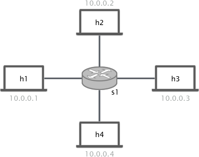

# 04-L2_Learning_Digest
Original network scenario can be found [here](https://github.com/nsg-ethz/p4-learning/tree/master/exercises/04-L2_Learning).
There, you can find a detailed explanation about the scenario, and the exercise (here only the solution is provided).

## Network Scenario

This is the network scenario topology: 



It is composed by four hosts `hx` and one switch `s1`. 
The switch is a bit smarter and has the capability of learning MAC 
addresses to port mappings autonomously, as a regular L2 switch would do.

L2 learning works as follows:

1. For every packet the switch receives, it checks if it has seen the `src_mac` address before. If its a new mac address,
it sends to the controller a tuple with (mac_address, ingress_port). The controller receives the packet and adds two rules
into the switch's tables. First it tells the switch that `src_mac` is known. Then, in another table it adds an entry to map
the mac address to a port (this table would be the same we used in the previous exercises).

2. The switch also checks if the `dst_mac` is known (using a normal forwarding table), if known the switch forwards
the packet normally, otherwise it broadcasts it. This second part of the algorithm has been already implemented in the previous
exercise.

For that we need a controller code, and instruct the switch to send the (mac, port) tuple to the controller.

In this exercise packets are sent to the controller using digests. 

## Testing the scenario
1. To run the network scenario, open a terminal in the scenario directory and type: 
```bash
kathara lstart 
```

2. For testing the P4 program, open a terminal on the switch and type:
```bash
python3 l2_learning_controller.py s1 digest
```

3. Open a terminal on one host and ping the others
```bash
root@h2:/# ping 10.0.0.1 
```

3. If all the hosts can reach the others, the switch is working. 

4. Verify that the switch table was populated: 

```bash
simple_switch_CLI
Obtaining JSON from switch...
Done
Control utility for runtime P4 table manipulation
RuntimeCmd: table_dump dmac_forward
```
You will see an output like this: 

```bash
==========
TABLE ENTRIES
**********
Dumping entry 0x0
Match key:
* ethernet.dstAddr    : EXACT     56d591e9ef57
Action entry: MyIngress.forward_to_port - 01
**********
Dumping entry 0x1
Match key:
* ethernet.dstAddr    : EXACT     00000a000001
Action entry: MyIngress.forward_to_port - 01
**********
Dumping entry 0x2
Match key:
* ethernet.dstAddr    : EXACT     00000a000003
Action entry: MyIngress.forward_to_port - 03
**********
Dumping entry 0x3
Match key:
* ethernet.dstAddr    : EXACT     aaa069235413
Action entry: MyIngress.forward_to_port - 01
**********
Dumping entry 0x4
Match key:
* ethernet.dstAddr    : EXACT     ae216761d5b9
Action entry: MyIngress.forward_to_port - 04
**********
Dumping entry 0x5
Match key:
* ethernet.dstAddr    : EXACT     36552b7beee0
Action entry: MyIngress.forward_to_port - 02
**********
Dumping entry 0x6
Match key:
* ethernet.dstAddr    : EXACT     0aa1ec57b3e0
Action entry: MyIngress.forward_to_port - 03
**********
Dumping entry 0x7
Match key:
* ethernet.dstAddr    : EXACT     426904966112
Action entry: MyIngress.forward_to_port - 04
**********
Dumping entry 0x8
Match key:
* ethernet.dstAddr    : EXACT     327445290855
Action entry: MyIngress.forward_to_port - 03
==========
Dumping default entry
Action entry: NoAction - 
==========

```

